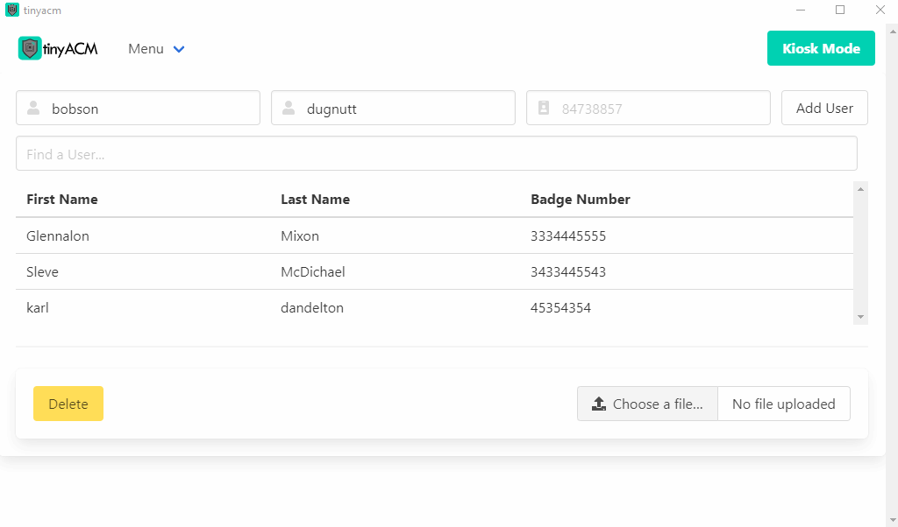

# tinyACM
A lightweight Access Control application for AdHoc situations.

## Backstory
A freind came to me with an issue of hosting a holiday party at a company, and wanted to implement access control.

It seems that - largely - the infrastructure and initial investment for something so simple just didn't make sense.

So I thought it would be neat to build a simple cross-platform app that can satisfy this niche need.

## The Goals
Lightweight (Relatively... it is electron, afterall) :heavy_check_mark:

No need for internet (Party in the desert?) :heavy_check_mark:

Secure Operator Mode with Swipe&Show --> To station someone to handle the badging, if desired :heavy_check_mark:

Journal --> To log entries and exits in the database :heavy_check_mark:

## Demo


## Installation
###### Windows [](https://github.com/AndrewDavis1191/tinyACM/raw/master/out/make/squirrel.windows/x64/tinyacm-1.0.0%20Setup.exe)
[Click Here for Windows Installer!](https://github.com/AndrewDavis1191/tinyACM/raw/master/out/make/squirrel.windows/x64/tinyacm-1.0.0%20Setup.exe)
###### OSX [](https://github.com/AndrewDavis1191/tinyACM/raw/master/out/make/zip/darwin/x64/tinyacm-darwin-x64-1.0.0.zip)
[Click Here for Mac Installer!](https://github.com/AndrewDavis1191/tinyACM/raw/master/out/make/zip/darwin/x64/tinyacm-darwin-x64-1.0.0.zip)

## Usage
Populate the users via the CRUD, or import a CSV of your users (this can be exported from your established Access Management System if you have one in place)

>Note: Format csv with columns: first_name, last_name, badge_number

Anyone in your list is considered "access granted"
Exclude users if you do not want them to have access

Set up a device that can accept badge reads via USB, like one of the PcProx readers shown below:


Switch to kiosk mode, and your AdHoc Access Control is ready to go!

## Tech used (so far)
```bash
├──HTML
│
├── CSS (bulma)
│
├── TypeScript (Nodejs/Electron)
│   ├── CryptoJS
│   └── fast-csv
│
├── SQLite3
```

## Contributing
Pull requests are welcome. For major changes, please open an issue first to discuss what you would like to change.

Please make sure to update tests as appropriate.

```bash
# clone the repo locally
git clone https://github.com/AndrewDavis1191/tinyACM.git
# install dependencies
npm install package.json
# start the app with npm
npm start
# if you want to build installer for your OS(windows/mac/linux)
npm run make
```

## Current Status and Remarks
This is currently what I wanted for MVP, but future goals would be to either use the node-serialport library to explore reading USB input directly or shell out the $200 for the PcProx sdk. I'd like to look into different readers and card types to understand the differences (hard to get my hands on different cards), and ultimately, it would be awesome to get this working with an iSTAR panel directly. Sort term goals involve blob management in sqlite to store and display photos on swipe and show.

## Constructive Criticism!
Please send feedback to me if you have suggestions on code in any manner; operation, readability, overall JavaScript best practices.

This is my first time messing around with JavaScript/TypeScript, Most of what I've done professionally is Powershell.:poop:

I started with vanilla JS, later migrated to TypeScript. Mostly because I wanted to see TS + later move to React/RN and actually appreciate the problems the technologies solve.

## License
[MIT](https://choosealicense.com/licenses/mit/)
